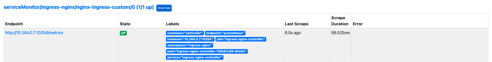

# hyphen-interview
This repo is created for sharing the hyphen interview test code

### Table of content
- [Overview](#overview)
- [Setup information](#setup-information)
    - [Local macbook](#local-macbook-setup)
- [Ingress deployment](#ingress-deployment)
- [Echo-http deployment](#echo-http-deployment)
- [Monitoring setup](#monitoring-setup)
- [ServiceMonitor](#servicemonitor)
- [Load Testing](#performace-or-load-testing )
- [Promql and CSV data](#promql-and-csv-data)
- [Link to video tutorial guide created by me for this interview](#video-guide-link)

### Overview
The guide aims towards setuping up services based to hypher group interview requirements.

Please do checkout my video link (Which the HR has access) where I have presented the solution following my own guide below.

### Setup information

I have tested this setup both on macbook os.

#### Local macbook setup
Pre-requists :
- [kind](https://kind.sigs.k8s.io/docs/user/quick-start/#installation) has to be installed 
- [Docker desktop](https://www.docker.com/products/docker-desktop) or alternative has to be setup 
- [Kubectl](https://kubernetes.io/docs/tasks/tools/) is installed
- [Helm](https://helm.sh/docs/intro/install/) is installed
- [k6](https://k6.io/docs/getting-started/installation/) optional based on mode of testing

Setting up kind cluster on macbook 
- Download my git repo using the command `git clone`
- Verify kind is installed properly using `kind --version`
- Change your dir `cd <repo-name>`
- Change dir to helper-scripts folder `cd 01-helper-scripts/kind-macbook`
- Run the bash script to setup a kind cluster which required for our ingress deployment `bash kind_cluster.sh`
- After the script finishes (Can take couple of mins) run `kubectl get pods --all-namespaces`
    - You should be to able to see some pods which are related to our K8's cluster


### Ingress deployment
- Let's go ahead now and deploy our ingress setup.
- Change your dir `cd ../../02-ingress-deployment`
- Deploy ingress setup `kubectl apply -f ingress_kind.yaml`
- Verify the deployment `kubectl get pods -n ingress-nginx`
### Echo-http deployment
- Verify if ingress setup is good `kubectl get pods -n ingress-nginx`
- We need to have our controller in running state
- Change your dir `cd ../03-echo-http-deployment`
- Deploy http-deployment `kubectl apply -f hashicorp_http.yaml -n ingress-nginx`

Verify if endpoints is reachable and works according to requiremetns 
- Run `curl localhost/foo`
```
foo
```
- Run `curl localhost/bar`
```
bar
```
- Let's check another endpoint and we should get error, run `curl localhost/something`
```
<html>
<head><title>404 Not Found</title></head>
<body>
<center><h1>404 Not Found</h1></center>
<hr><center>nginx</center>
</body>
</html>
```
- This validates that our setup works fine and ingress is working according to our requirements.
### Monitoring setup
- Let's move to our next requirements, Setting up monitoring tools
- We shall use `kube-prometheus` and deploy via helm in the same namespace.
- Note : We can seperate the namespace if required.
- Add `kube-prometheus` to helm repo
```
helm repo add prometheus-community https://prometheus-community.github.io/helm-charts
```
- Update helm repo `helm repo update`
- Install prometheus stack
```
helm install prometheus prometheus-community/kube-prometheus-stack -n ingress-nginx
```
- Validate if all pods are running fine `kubectl get pods --selector=release=prometheus -n ingress-nginx`
- Validate other monitoring stacks are also running `kubectl get pods -n ingress-nginx` 

Accessing monitoring URL
- It can take 2-3 mins for all pods/services to be ready.
- Using portforward we can access prometheus url `kubectl port-forward service/prometheus-kube-prometheus-prometheus 9090
`
- Open browser and access `localhost:9090`, You should be able to access promethues webUi now

### ServiceMonitor
- We need to add a servicemonitor to scrap the metrics from our ingress setup.
- During the deployment of the ingress setup we have made the required changes already to expose these metrics
- Change dir `cd ../04-monitoring-setup`
- Setup servicemonitor `kubectl apply -f servicemonitor.yaml -n ingress-nginx`
- Validate `kubectl get servicemonitor -n ingress-nginx` and you should be able to see `nginx-ingress-custom ` meaning prometheus now can scrape this metrics also
- Open promethues URL
    - Port ward `kubectl port-forward service/prometheus-kube-prometheus-prometheus 9090 -n ingress-nginx`
    - Open browser and access `localhost:9090`, You should be able to access promethues webUi now
    - You should be able to see `nginx-ingress-custom` which is our ingress service.


#### Performace or Load Testing with shell script
- Run the script for 200x
```
while true
do
  sleep 1
  curl -I localhost/foo
  curl -I localhost/bar
done
```
- Run the script for 500x and 400x
```
while true
do
  sleep 1
  curl -I localhost/potato
done
```

### [Bonus] Performace or Load Testing

- Install k6 if not present [Prerqu]
- Change dir `cd ../05-performace-testing`
- Run k6 with 10 virtual users `k6 run --vus 10 --duration 30s k6-performace-testing.js `
- This might fail because of clusterIP issue. But can be developed further if required.

### [Incomplete] Promql and CSV data
 * Enable Prometheus `kubectl port-forward service/prometheus-kube-prometheus-prometheus 9090 -n ingress-nginx`
 * Average CPU : http://localhost:9090/api/v1/query?query=sum(rate(nginx_ingress_controller_nginx_process_cpu_seconds_total{}[10m]))
 * Average Memory : http://localhost:9090/api/v1/query?query=avg(nginx_ingress_controller_nginx_process_resident_memory_bytes{}/ 1000 / 1000)
 * 
### Video guide link

I have created a small video explaing how I have run this following my own guide sharing some thoughts also during the process. 

This way you can also get to know my thinking process. Just a add-on.
